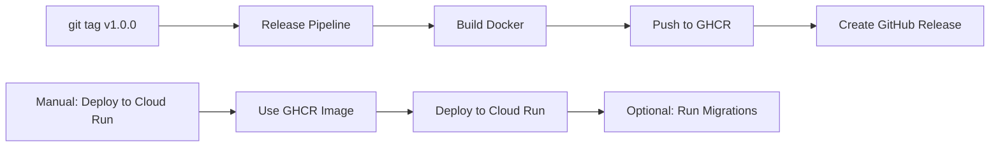

# GitHub Actions Workflows

Este directorio contiene los workflows de CI/CD para ASAM Backend.

## Workflows Activos

### 1. `ci.yml` - Integración Continua
- **Trigger**: Push a `main` o Pull Requests
- **Acciones**: Lint, tests unitarios e integración
- **Duración**: ~5 minutos

### 2. `release.yml` - Pipeline de Release
- **Trigger**: Tags con formato `v*.*.*`
- **Acciones**: 
  - Verificación de código
  - Creación de release en GitHub
  - Build y push de Docker image a GitHub Container Registry (público)
- **Duración**: ~7 minutos

### 3. `cloud-run-deploy.yml` - Despliegue a Cloud Run
- **Trigger**: Manual (workflow_dispatch)
- **Acciones**:
  - Deploy directo desde GitHub Container Registry
  - Opción de ejecutar migraciones
- **Duración**: ~2-3 minutos

## Flujo de Release y Despliegue



## Configuración de Secretos

Los siguientes secretos deben estar configurados en GitHub:

### Google Cloud Platform
- `GCP_PROJECT_ID`: ID del proyecto de GCP
- `GCP_SA_KEY`: Clave JSON de la cuenta de servicio

### Base de datos (en Google Secret Manager)
- `db-host`: Host de PostgreSQL
- `db-port`: Puerto
- `db-user`: Usuario
- `db-password`: Contraseña
- `db-name`: Nombre de la base de datos

### Seguridad (en Google Secret Manager)
- `jwt-access-secret`: Secret para JWT access tokens
- `jwt-refresh-secret`: Secret para JWT refresh tokens
- `admin-user`: Usuario administrador
- `admin-password`: Contraseña del administrador

### Email (opcional, en Google Secret Manager)
- `smtp-user`: Usuario SMTP
- `smtp-password`: Contraseña SMTP

## Uso

### 1. Crear un Release

```bash
git tag -a v1.0.0 -m "Release v1.0.0"
git push origin v1.0.0
```

### 2. Desplegar a Cloud Run

1. Ir a Actions → "Deploy to Google Cloud Run"
2. Click "Run workflow"
3. Seleccionar:
   - Environment: `production`
   - Image tag: `v1.0.0` (o `latest`)
   - Run migrations: ✓ (si es necesario)

### 3. Ejecutar solo migraciones

Usar el script local:
```bash
# Windows
.\scripts\run-production-migrations.ps1

# Linux/Mac
./scripts/run-production-migrations.sh
```

## Notas Importantes

- El paquete Docker en GitHub Container Registry es **público** para permitir acceso directo desde Cloud Run
- Las imágenes NO contienen secretos, todos están en Google Secret Manager
- El workflow de deploy NO reconstruye imágenes, usa las ya publicadas

## Carpeta `examples/`

Contiene workflows alternativos y documentación adicional:
- Workflows con diferentes estrategias de build
- Scripts de configuración para otros registros
- Documentación de optimizaciones
