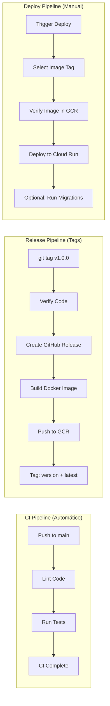

# GitHub Actions Workflows

Este directorio contiene los workflows de CI/CD para ASAM Backend.

## Workflows Activos

### 1. `ci.yml` - Integración Continua
- **Trigger**: Push a `main` o Pull Requests
- **Acciones**: 
  - Lint y verificación de código
  - Tests unitarios e integración
- **Duración**: ~5 minutos

### 2. `release.yml` - Pipeline de Release
- **Trigger**: Tags con formato `v*.*.*`
- **Acciones**: 
  - Verificación de código
  - Creación de release en GitHub
  - Build y push de Docker image a Google Container Registry
- **Duración**: ~7 minutos

### 3. `cloud-run-deploy.yml` - Despliegue a Cloud Run
- **Trigger**: Manual (workflow_dispatch)
- **Acciones**:
  - Verifica que la imagen existe en GCR
  - Despliega imagen pre-construida desde Google Container Registry
  - Opción de ejecutar migraciones
- **Duración**: ~2-3 minutos

## Flujo de CI/CD



## Configuración de Secretos

Los siguientes secretos deben estar configurados en GitHub:

### Google Cloud Platform
- `GCP_PROJECT_ID`: ID del proyecto de GCP
- `GCP_SA_KEY`: Clave JSON de la cuenta de servicio

### Base de datos (en Google Secret Manager)
- `db-host`: Host de PostgreSQL
- `db-port`: Puerto
- `db-user`: Usuario
- `db-password`: Contraseña
- `db-name`: Nombre de la base de datos

### Seguridad (en Google Secret Manager)
- `jwt-access-secret`: Secret para JWT access tokens
- `jwt-refresh-secret`: Secret para JWT refresh tokens
- `admin-user`: Usuario administrador
- `admin-password`: Contraseña del administrador

### Email (opcional, en Google Secret Manager)
- `smtp-user`: Usuario SMTP
- `smtp-password`: Contraseña SMTP

## Uso

### 1. CI - Validación Automática

Cada vez que se hace push a `main` o se crea un PR, automáticamente:
- Se ejecuta el linter para verificar calidad del código
- Se ejecutan los tests unitarios e integración
- NO se construyen imágenes Docker (esto solo ocurre en releases)

### 2. Crear un Release y Docker Image

```bash
# Crear un tag con versión semántica
git tag -a v1.0.0 -m "Release v1.0.0"
git push origin v1.0.0
```

Esto automáticamente:
- Verifica el código
- Crea un GitHub Release con changelog
- Construye la imagen Docker oficial
- La sube a GCR con tags:
  - `v1.0.0` (la versión específica)
  - `latest` (actualizado a esta versión)

### 3. Desplegar a Cloud Run

1. Ir a Actions → "Deploy to Google Cloud Run"
2. Click "Run workflow"
3. Seleccionar:
   - Environment: `production`
   - Image tag: 
     - `v1.0.0` (versión específica del release)
     - `latest` (la última versión released)
   - Run migrations: ✓ (si es necesario)

### 4. Ver Imágenes Disponibles

```bash
# Ver todas las imágenes disponibles en GCR
gcloud container images list-tags gcr.io/[PROJECT_ID]/asam-backend
```

### 5. Ejecutar solo migraciones

Usar el script local:
```bash
# Windows
.\scripts\run-production-migrations.ps1

# Linux/Mac
./scripts/run-production-migrations.sh
```

## Notas Importantes

- Las imágenes Docker se almacenan en Google Container Registry (GCR)
- **CI NO construye imágenes**, solo valida código (lint + tests)
- **Release construye las imágenes oficiales** cuando se crea un tag versionado
- **Deploy usa imágenes pre-construidas** de releases anteriores
- Las imágenes NO contienen secretos, todos están en Google Secret Manager
- Cada release crea dos tags de imagen:
  - La versión específica (ej: `v1.0.0`)
  - `latest` (siempre apunta al último release)

## Solución de Problemas Comunes

### Error: "gcr.io repo does not exist"

Si el Release Pipeline falla con este error al intentar subir imágenes:
```
denied: gcr.io repo does not exist. Creating on push requires the artifactregistry.repositories.createOnPush permission
```

**Solución:**
1. Verifica que la cuenta de servicio tenga el rol **Storage Admin**
2. Ejecuta el script de corrección:
   ```bash
   # Windows
   .\scripts\gcp\fix-gcr-permissions.ps1 <PROJECT_ID>
   
   # Linux/Mac
   ./scripts/gcp/fix-gcr-permissions.sh <PROJECT_ID>
   ```
3. Vuelve a ejecutar el workflow

Para más detalles sobre GCP, consulta [gcp-project-setup.md](../../docs/gcp-project-setup.md) (la carpeta `scripts/gcp/` es local opcional si la tienes en tu máquina).

## Carpeta `examples/`

Contiene workflows alternativos y documentación adicional:
- Workflows con diferentes estrategias de build
- Scripts de configuración para otros registros
- Documentación de optimizaciones
