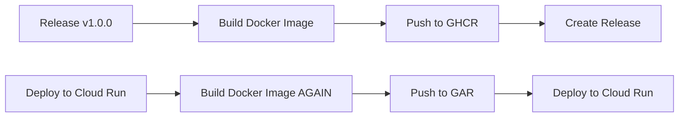
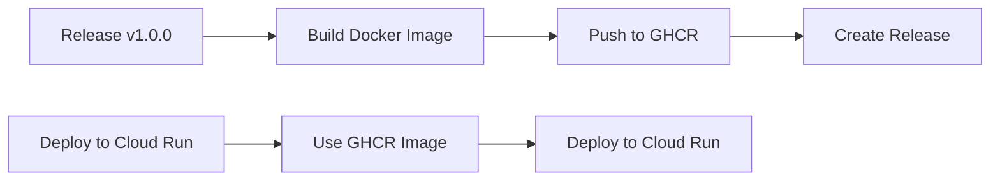

# Optimización del Workflow de Deploy

## Problema identificado

El workflow original de Cloud Run duplicaba el trabajo de construcción de imágenes Docker:

1. **Release workflow**: Construía y publicaba la imagen en GitHub Container Registry
2. **Cloud Run Deploy workflow**: Volvía a construir la misma imagen

Esta duplicación causaba:
- ⏱️ Tiempo adicional innecesario (~5-10 minutos)
- 💰 Costos de procesamiento duplicados
- 🔄 Posibles inconsistencias entre builds

## Solución implementada

El nuevo workflow optimizado:
- ✅ **NO reconstruye** la imagen
- ✅ **Usa directamente** la imagen ya publicada en GitHub Container Registry
- ✅ **Permite especificar** qué versión desplegar

## Comparación de flujos

### Flujo anterior (con duplicación)


### Flujo optimizado (sin duplicación)


## Uso del workflow optimizado

### Desplegar la última versión (latest)
```yaml
Environment: production
Image tag: latest  # o dejar vacío
Run migrations: ✓/✗
```

### Desplegar una versión específica
```yaml
Environment: production
Image tag: v1.0.0  # o 1.0.0
Run migrations: ✓/✗
```

## Ventajas

1. **Más rápido**: ~2-3 minutos vs ~10-15 minutos
2. **Más simple**: Sin duplicación de lógica
3. **Más consistente**: Una sola imagen construida
4. **Más económico**: Sin builds redundantes

## Casos de uso

### Después de un release
1. Se crea el release (construye imagen)
2. Se ejecuta "Deploy to Cloud Run" con tag `v1.0.0`

### Rollback rápido
1. Ejecutar "Deploy to Cloud Run"
2. Especificar una versión anterior: `v0.9.0`
3. En segundos está desplegada

### Despliegue de prueba
1. Build manual con tag específico
2. Deploy con ese tag en staging

## Archivos

- **Actual**: `.github/workflows/cloud-run-deploy.yml` (optimizado)
- **Anterior**: `.github/workflows/examples/cloud-run-deploy-with-build.yml` (con duplicación)
