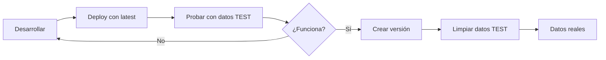

# 🚀 Guía de Desarrollo Simplificada - ASAM Backend

## 📋 Filosofía del Proyecto

Este es un proyecto **pequeño y pragmático** para gestionar la base de datos de ASAM (Asociación de Ayuda Mutua).

**Principios:**
- ✅ **Simplicidad sobre complejidad** - Un solo ambiente es suficiente
- ✅ **Pragmatismo** - Estamos en desarrollo, no necesitamos CI/CD complejo
- ✅ **Velocidad** - Deploy directo a producción para feedback inmediato
- ✅ **Económico** - Mantenerse en la capa gratuita de Google Cloud

## 🎯 Flujo de Trabajo

### 1️⃣ **Desarrollo Local**
```bash
# Trabajar en el código
code .

# Probar localmente
go run cmd/api/main.go
```

### 2️⃣ **Deploy Rápido**
```powershell
# Ver estado actual
.\scripts\ops\simple-deploy.ps1 status

# Hacer deploy (te preguntará qué versión)
.\scripts\ops\simple-deploy.ps1 deploy

# Ver logs en tiempo real
.\scripts\ops\simple-deploy.ps1 logs
```

### 3️⃣ **Gestión de Datos de Prueba**
```powershell
# Cargar datos de prueba (con sufijo TEST)
.\scripts\ops\test-data.ps1 load

# Ver estado
.\scripts\ops\test-data.ps1 status

# Limpiar solo datos TEST cuando estés listo
.\scripts\ops\test-data.ps1 clear
```

## 🔄 Ciclo de Desarrollo Típico



## 📦 Versiones

### Durante Desarrollo
```powershell
# Usar 'latest' para desarrollo activo
.\scripts\ops\simple-deploy.ps1 deploy
# Seleccionar: L (latest)
```

### Para Hitos Importantes
```powershell
# Crear una versión cuando algo esté estable
git tag -a v0.2.0 -m "Frontend 40% completo"
git push origin v0.2.0

# Deploy de esa versión
.\scripts\ops\simple-deploy.ps1 deploy
# Seleccionar el número de la versión
```

## 🛟 Seguridad y Backups

### Antes de Cambios Importantes
```powershell
# Hacer backup manual
.\scripts\ops\backup-database.ps1

# El deploy también pregunta si quieres backup
.\scripts\ops\simple-deploy.ps1 deploy
# ¿Hacer backup? → S
```

### Si Algo Sale Mal
```powershell
# Rollback rápido a versión anterior
.\scripts\ops\simple-deploy.ps1 rollback
```

## 💰 Mantener Costos en 0€

**Configuración actual optimizada:**
- `min-instances=0` → Se apaga sin tráfico
- `max-instances=2` → Suficiente para ASAM
- `memory=512Mi` → Balance perfecto

**Monitorear uso:**
```powershell
.\scripts\ops\monitor-usage.ps1
```

## 🎨 Frontend + Backend

Cuando tengas el frontend listo:
1. El frontend apuntará a: `https://asam-backend-jtpswzdxuq-ew.a.run.app`
2. Configurar CORS en el backend si es necesario
3. Deploy del frontend a Firebase Hosting o Netlify (gratis también)

## ⚡ Comandos Rápidos

```powershell
# Lo que más usarás:
.\scripts\ops\simple-deploy.ps1 status   # ¿Qué hay desplegado?
.\scripts\ops\simple-deploy.ps1 deploy   # Actualizar
.\scripts\ops\simple-deploy.ps1 logs     # Ver qué pasa

# Datos de prueba:
.\scripts\ops\test-data.ps1 load        # Meter datos TEST
.\scripts\ops\test-data.ps1 clear       # Borrar datos TEST

# Por si acaso:
.\scripts\ops\backup-database.ps1        # Guardar copia
.\scripts\ops\simple-deploy.ps1 rollback # Volver atrás
```

## 📞 URLs Importantes

- **Backend**: https://asam-backend-jtpswzdxuq-ew.a.run.app
- **GraphQL Playground**: https://asam-backend-jtpswzdxuq-ew.a.run.app/graphql
- **Health Check**: https://asam-backend-jtpswzdxuq-ew.a.run.app/health

## ✅ Checklist para Producción Real

Cuando termines el desarrollo (100% frontend):

- [ ] Limpiar todos los datos TEST
- [ ] Hacer backup final de desarrollo
- [ ] Crear versión v1.0.0
- [ ] Deploy de v1.0.0
- [ ] Configurar dominio www.mutuaasam.org
- [ ] Agregar SSL (automático con Cloud Run)
- [ ] Cargar datos reales
- [ ] Entregar credenciales a tu amigo

---

**Recuerda:** Este es un proyecto pequeño. No necesitas complicarte con CI/CD empresarial. 
Focus en que funcione bien para los usuarios de ASAM. 🎯
